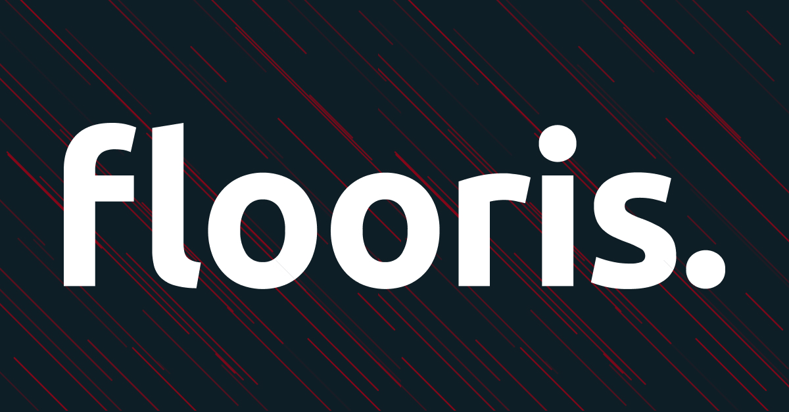

# :package_description

[](https://packagist.org/packages/:vendor_slug/:package_slug)
[](https://github.com/:vendor_slug/:package_slug/actions?query=workflow%3Arun-tests+branch%3Amain)
[](https://github.com/:vendor_slug/:package_slug/actions?query=workflow%3A"Fix+PHP+code+style+issues"+branch%3Amain)
[](https://packagist.org/packages/:vendor_slug/:package_slug)

## Flooris
---

<!--  -->

We are a young and driven team of technicians with a mission. We ensure that our clients' online challenges are solved with manageable and sustainable tools. We connect existing and reliable solutions to each other. This allows us to create customized solutions, often in combination with professional (open-source) packages and APIs. We ensure that all online solutions always perform at the highest level. In addition, we provide professional support without hassle through our service portal.


## Installation
---

You can install the package via composer:

```bash
composer require :vendor_slug/:package_slug
```

You can publish and run the migrations with:

```bash
php artisan vendor:publish --tag=":package_slug-migrations"
php artisan migrate
```

You can publish the config file with:

```bash
php artisan vendor:publish --tag=":package_slug-config"
```

This is the contents of the published config file:

```php
return [
];
```

Optionally, you can publish the views using

```bash
php artisan vendor:publish --tag=":package_slug-views"
```


## Usage
---

```php
$variable = new VendorName\Skeleton();
echo $variable->echoPhrase('Hello, VendorName!');
```


## Testing
---

Run following command to run pest test cases
```bash
composer test
```


## Changelog
---


Please see [CHANGELOG](CHANGELOG.md) for more information on what has changed recently.


## Contributing
---

Please see [CONTRIBUTING](CONTRIBUTING.md) for details.


## Security Vulnerabilities
---

Please review [our security policy](../../security/policy) on how to report security vulnerabilities.


## Credits
---

- [:author_name](https://github.com/:author_username)
- [All Contributors](../../contributors)


## License
---

The MIT License (MIT). Please see [License File](LICENSE.md) for more information.


<!--delete-->
## template information
---

This repo can be used to scaffold a Laravel package. Follow these steps to get started:

1. Press the "Use this template" button at the top of this repo to create a new repo with the contents of this skeleton.
2. Run "php ./configure.php" to run a script that will replace all placeholders throughout all the files.
3. Have fun creating your package.
